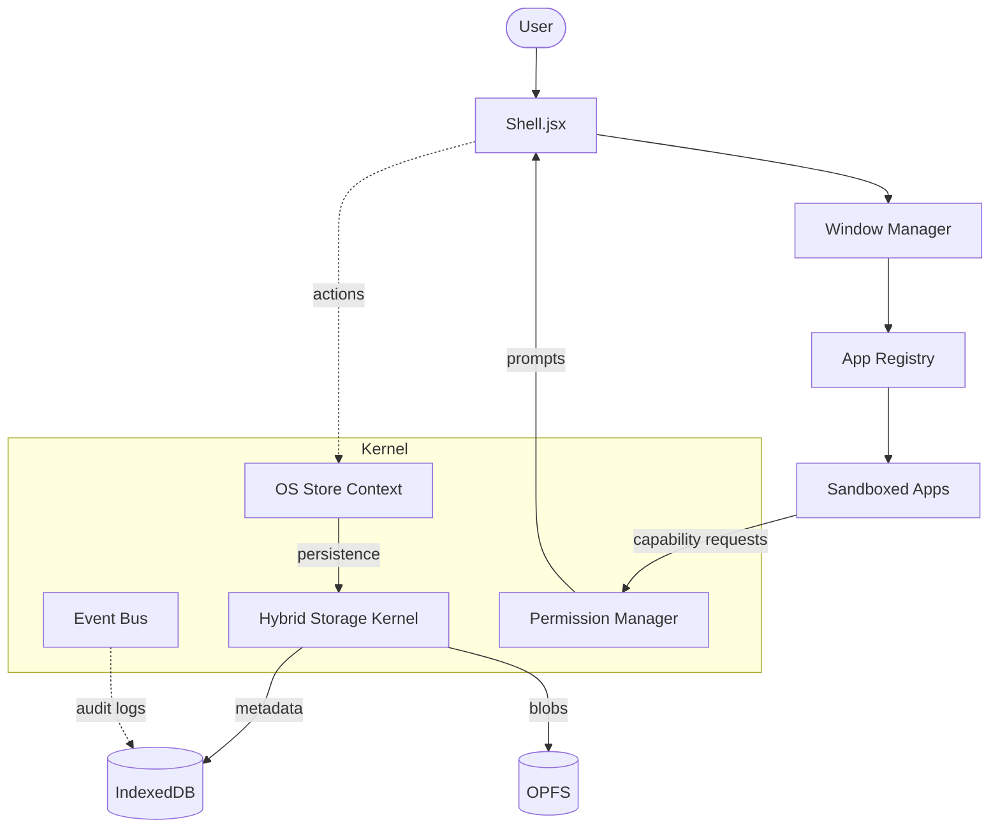

# 🌃 Night City OS

[](https://github.com/Raoof128/night_city_os)
[](https://reactjs.org/)
[](https://vitejs.dev/)
[](https://tailwindcss.com/)

Night City OS is a production-grade, browser-based operating system simulation inspired by Cyberpunk 2077. It ships with draggable glassmorphism windows, functional finance tooling, AI-powered receipt parsing, animated network visualizations, and a configurable desktop environment.

---

## 🚀 Highlights
- **Hybrid Storage Engine**: State-of-the-art persistence using **IndexedDB** for metadata and **OPFS** (Origin Private File System) for binary assets. Zero-latency moves and reliable backups.
- **File System**: Full-featured File Explorer with drag-drop, folder trees, and support for mounting **local drives** directly into the OS.
- **Window Management**: Snapping (tiling), virtual desktops (spaces), minimize/maximize animations, and focus history.
- **Finance suite**: Shared spaces, permissions, anomaly detection, receipt scanning, and gamified savings quests.
- **Strategic Ops**: Mission-style goal engine (vaults, debt liquidation) with FIRE/legacy projections.
- **Cybersec workspace**: Construct AI chat, Icebreaker code editor, SysMon, and Vault secure store.
- **Resilience**: Global error boundary with auto-recovery, kernel-level event bus, and "Hard Reset" recovery.
- **Audit Logging**: Immutable security logs tracking all permission decisions and system events.
- **Profile Isolation**: Isolated storage and settings for multiple user profiles.
- **Theming**: Arasaka palette with CRT overlays, neon grids, and toggleable stealth/privacy modes.

---

## 🗺️ Architecture Overview (V5 Kernel)



---

## 🧱 Tech Stack
- **Framework**: React 18 + Vite
- **Storage**: IndexedDB + OPFS (Origin Private File System)
- **Styling**: Tailwind CSS, custom design tokens, glassmorphism overlays
- **Animation**: framer-motion
- **Testing**: Vitest + React Testing Library
- **Tooling**: ESLint, Prettier, Husky, lint-staged, GitHub Actions CI

---

## 🏁 Quickstart
1. **Install prerequisites**
   - Node.js 20+
   - npm 9+
2. **Install dependencies**
   ```bash
   npm install
   ```
3. **Run the OS locally**
   ```bash
   npm run dev
   ```
4. **Production build**
   ```bash
   npm run build
   ```
5. **Preview the production bundle**
   ```bash
   npm run preview
   ```

### Environment variables
Create a `.env.local` (or `.env`) file for client-side keys:
```env
VITE_GEMINI_API_KEY=your_google_ai_key
```
These values remain in the browser; do not commit secrets to the repository.

### Quality gates
| Command | Purpose |
| --- | --- |
| `npm run lint` | ESLint with React + hooks rules. |
| `npm run format` | Prettier formatting for JS/JSX/CSS. |
| `npm run test -- --run` | Vitest unit/integration test run (includes `useSound` Web Audio coverage). |
| `npm run test:coverage` | Coverage report. |
| `npm run build` | Production bundle validation. |

---

## 🧭 Repository Layout
```
.
├── src/               # Application source
│   ├── components/    # Common UI components (Shell, WindowFrame, etc.)
│   ├── os/            # Core OS Kernel
│   │   ├── kernel/    # Persistence, Permissions, Registry, EventBus
│   │   ├── store/     # OSContext and Reducer
│   │   └── components/# OS-level UI (Desktop, Taskbar, LockScreen)
│   ├── apps/          # sandboxed user applications
│   ├── hooks/         # System-wide hooks
│   └── utils/         # Theming, validation, security
├── tests/             # Vitest suite (Unit, Integration, E2E)
├── docs/              # Architecture, User Manual, Phase Reports
├── public/            # Static assets
└── .github/workflows/ # CI configuration (Lint, Test, Deploy)
```

---

## 🧩 Applications & Controls
- **Command palette**: `Cmd/Ctrl + K`
- **Privacy mode**: `Cmd/Ctrl + Shift + P`
- **Stealth mode**: Toggle via right-click context menu
- **Receipt scanner**: Drop images on the Desktop Upload widget; validated, categorized transactions appear in Finance.
- **Taskbar search**: Natural language search to open apps.
- **Shared spaces**: Role-based finance management with approval workflows and audit logging.
- **Cybersec apps**:
  - **CONSTRUCT**: Silverhand-style AI chat with streaming responses.
  - **ICEBREAKER**: Syntax-highlighted code editor with RUN sandbox and neon line numbers.
  - **SYS_MON**: Canvas-based rolling waveforms for memory and net traffic.
  - **VAULT**: Biometric/PIN hold unlock with persistent secret list (mock-encrypted).
- **Audio SFX**: First user interaction unlocks Web Audio; hover blips + window hums honor volume/mute in Settings.

For feature-by-feature guidance, see [`docs/USER_MANUAL.md`](docs/USER_MANUAL.md).

---

## 🔒 Security & Data Handling
- **Profile Isolation**: All user data is isolated by `profileId` within separate IndexedDB and OPFS namespaces.
- **Audit Logging**: Critical system actions and permission grants are logged to a persistent audit trail.
- **Sandboxing**: Applications run inside an `AppContainer` with restricted access to system APIs via the `AppContext`.
- **Environment Keys**: Gemini API keys remain in the browser; do not commit secrets.
- See [`SECURITY.md`](SECURITY.md) for more.

---

## 🤝 Contributing
1. Fork and branch from `main`.
2. Run linting and tests before opening a PR.
3. Update documentation alongside code changes.
4. Follow the [Code of Conduct](CODE_OF_CONDUCT.md).

---

## 📜 License
MIT License © Night City OS maintainers. See [`LICENSE`](LICENSE) for details.
