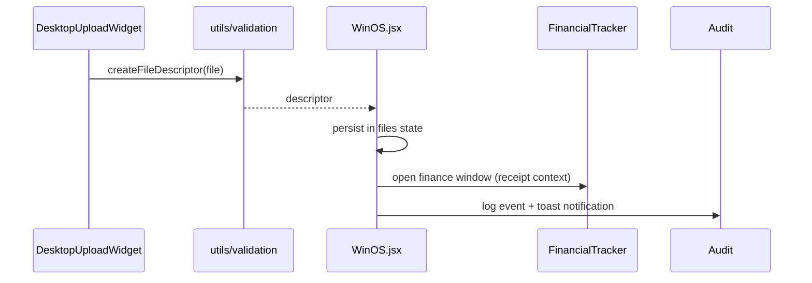

# 🛠 Technical Architecture: Night City OS

This document captures the structure, data flows, and operational guarantees of the Night City OS simulation. Treat it as the onboarding map for contributors and auditors.

---

## 1. System Layout

```mermaid
flowchart LR
    subgraph Shell
        WinOS[WinOS.jsx\nDesktop Shell]
        WindowFrame
        StartMenu
        Taskbar
    end
    subgraph Apps
        FinancialTracker
        FileExplorer
        Terminal
        Calculator
        MusicPlayer
        Construct[Construct AI]
        Icebreaker[Icebreaker Editor]
        SysMon[System Monitor]
        Vault[Vault]
        NetworkMap
        TextPad
        Settings
    end
    subgraph Kernel
        Store[OS Store (Redux)]
        Storage[StorageKernel (IDB+OPFS)]
        EventBus
    end
    User --> WinOS
    WinOS --> Store
    Store --> Storage
    Store --> Apps
    Apps --> EventBus
```

**Key principles**
- **Single shell, modular apps**: `Shell.jsx` owns orchestration while each app under `src/apps/` remains isolated and composable.
- **Hybrid Storage**: Metadata lives in IndexedDB for fast queries; binary content lives in OPFS for performance.
- **Event Driven**: System events (errors, logs, window ops) flow through a central `EventBus`.

---

## 2. State Management
- **Persistent slices**:
  - `windows`: active windows, z-order, snap state, and minimization state.
  - `fs`: in-memory cache of the file system tree (persisted to IDB).
  - `spaces`: virtual desktops and their configurations.
  - `theme`: visual preferences (mode, volume).
  - `quickSettings`: toggles for DND, WiFi, etc.
- **Storage Engine**:
  - `sys_kv`: IndexedDB store for OS snapshots.
  - `fs_nodes`: IndexedDB store for file metadata.
  - `blobs`: OPFS directory for file content.

State is managed via `useReducer` in `OSProvider`, with side-effects syncing to `StorageKernel`.

---

## 3. Window Management
- **Creation**: `openWindow(appId, data)` spawns a window or restores it if already present.
- **Z-ordering**: `bringToFront` reorders the `windows` array so the active window renders last.
- **Minimize/Close**: `toggleMinimize` flips window visibility without losing state; `closeWindow` removes it from the persistent array.
- **Taskbar**: mirrors `windows` state, allowing fast focus toggles.

---

## 4. Data & Validation Pipelines

### 4.1 File ingestion (Desktop Upload)
1. **Drop/Select**: `DesktopUploadWidget` hands the uploaded file to `handleFileUpload`.
2. **Validation**: `createFileDescriptor` (in `utils/validation`) normalizes metadata and guards missing files.
3. **Persistence**: file descriptors are appended to `files` and rendered in the `SHARDS` window.
4. **Audit**: events logged via `logger` and `auditLog`.

### 4.2 Transaction ingestion (Finance)
1. **Source**: manual entry or AI receipt parsing triggers `handleTransactionUpdate`.
2. **Validation**: `validateTransactionPayload` enforces numeric amounts and sane summaries.
3. **Permissions**: `checkPermission` ensures the active user can mutate finance data.
4. **Categorization**: `categorizeTransaction` classifies spending, detects anomalies, and flags recurrences.
5. **Approval flow**: transactions over the configured threshold are marked `Pending Approval` and do not impact balances until cleared.



---

## 5. Security & Privacy Considerations
- **Client-only execution**: No backend; all data stays in the browser sandbox.
- **Input validation**: All uploads and finance mutations are checked before persistence to avoid corrupting saved state.
- **Telemetry**: `logger` prefixes output (`[NC/*]`) for easy filtering in browser consoles; `auditLog` captures key security events.
- **Audio unlock**: `useSound` lazily instantiates Web Audio and resumes on first pointer/keyboard gesture to respect browser autoplay rules.
- **Secrets**: API keys are user-supplied via Vite env vars and must never enter source control.

---

## 6. Audio Engine
- **Hook**: `hooks/useSound` centralizes audio context creation, volume/mute handling, and tone generation.
- **Safety**: Context is created lazily and unlocked via user gestures to avoid autoplay violations; playback is try/catch wrapped for browsers that block audio.
- **Consumers**: `WinOS.jsx` calls `play` on boot, errors, hover, and window creation. Extend sounds by adding new tone presets in `useSound`.
- **Palette**: Hover blips (`hover`), window hums (`hum`), and error bursts (`error`) follow palette-compliant oscillator frequencies.

---

## 7. Testing Strategy
- **Unit tests**: Utilities (spaces, helpers, validation) validated via Vitest under `tests/unit/`.
- **Component tests**: PsychoCybernetics and finance utilities validated for regression coverage.
- **Audio tests**: `tests/unit/useSound.test.js` stubs AudioContext to assert playback, mute behavior, and gesture-based resume.
- **Code highlighter**: `tests/unit/codeHighlighter.test.js` validates neon keyword wrapping for Icebreaker.
- **CI**: GitHub Actions runs lint → tests → build on pushes/PRs to `main`.

---

## 8. Extensibility Playbook
- **Add an app**: create a component under `src/apps/`, register it in the `apps` map inside `WinOS.jsx`, and provide an icon + title.
- **Add persistent data**: use `usePersistentState` for any state that must survive reloads and supply clear defaults.
- **Extend validation**: centralize new input guards in `src/utils/validation.js` and cover them with tests in `tests/unit/`.
- **Strategic Ops**: use `src/utils/strategicOps.js` for deterministic projections (FIRE, legacy funds, round-ups, debt ranking) and render via `StrategicOperations.jsx`.

---

## 9. Performance Notes
- Framer-motion handles drag physics; limit simultaneous animations to preserve smoothness.
- Large images are not stored in memory; file descriptors only track metadata to keep localStorage footprint small.
- Command palette and context menus are unmounted via `AnimatePresence` to prevent hidden DOM bloat.
